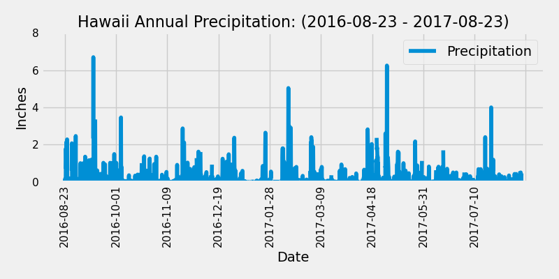

# sqlalchemy-challenge
Module 10 Challenge

This repository analyzes climate data for Honolulu, Hawaii.
____________________________________________________________________

### REPOSITORY CONTENTS

- SurfsUp Folder, which contains
    - Resources folder containing an .sqlite file and two .csv files
    - Images folder containing two figures from Jypyter notebook
    - climate_starter.ipynb - Jupyter Notebook containing climate analysis
    - app.py - python file containing _______________
- gitignore file
____________________________________________________________________

During analysis, precipitation amount (inches) was measured from 8-23-2016 - 8-23-2017 at 9 different stations.  This is represented in the figure below.

Average temperature was also measured for the same time period (8-23-2016 - 8-23-2017) at the station with the most data. This is represented in the figure below.

____________________________________________________________________

### REFERENCES

- datetime error help: https://stackoverflow.com/questions/19480028/attributeerror-datetime-module-has-no-attribute-strptime by user25555451

- converting datetime into string: https://stackoverflow.com/questions/10624937/convert-datetime-object-to-a-string-of-date-only-in-python by Levon and gizzmole

- aggregating summary statistics: https://pandas.pydata.org/docs/getting_started/intro_tutorials/06_calculate_statistics.html

- func.count formatting: https://docs.sqlalchemy.org/en/14/orm/query.html

- class activites and slides